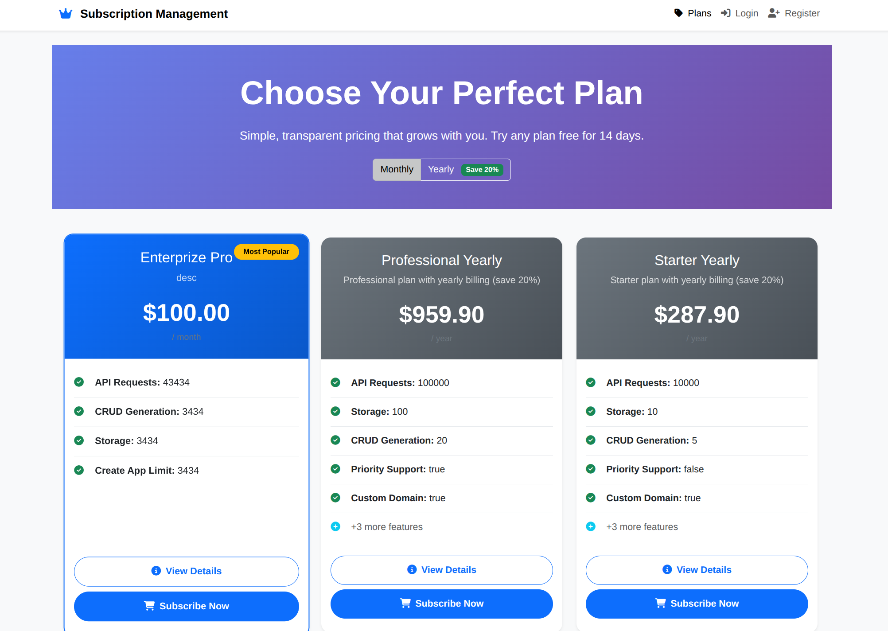
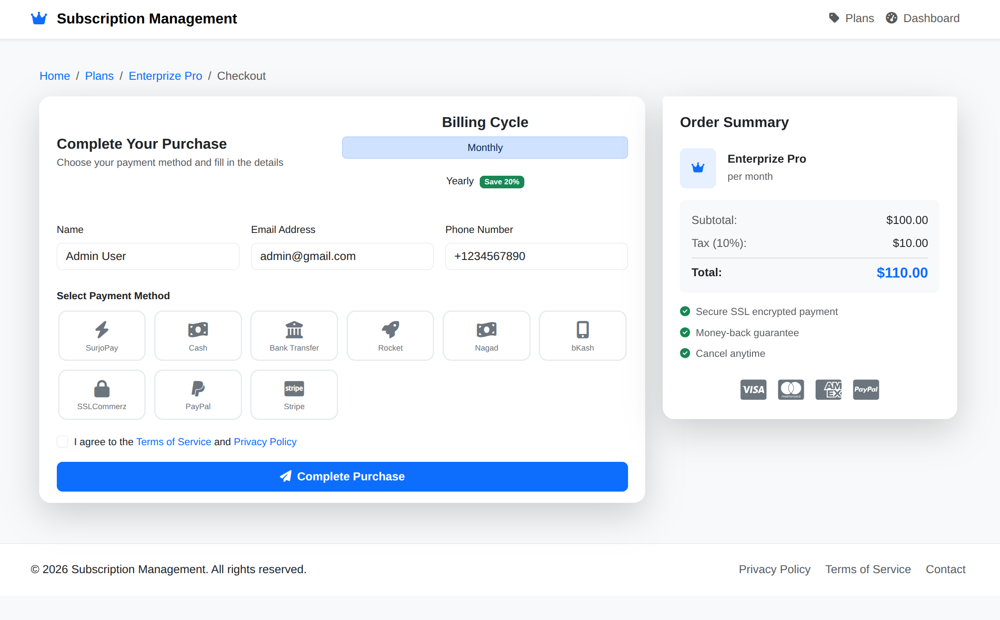
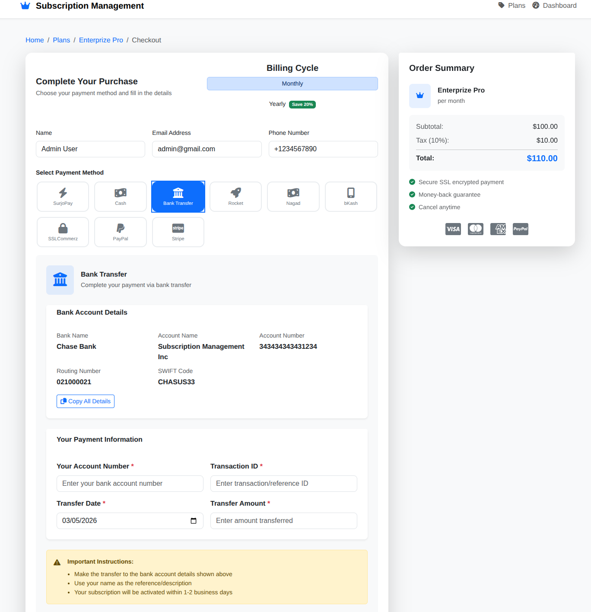
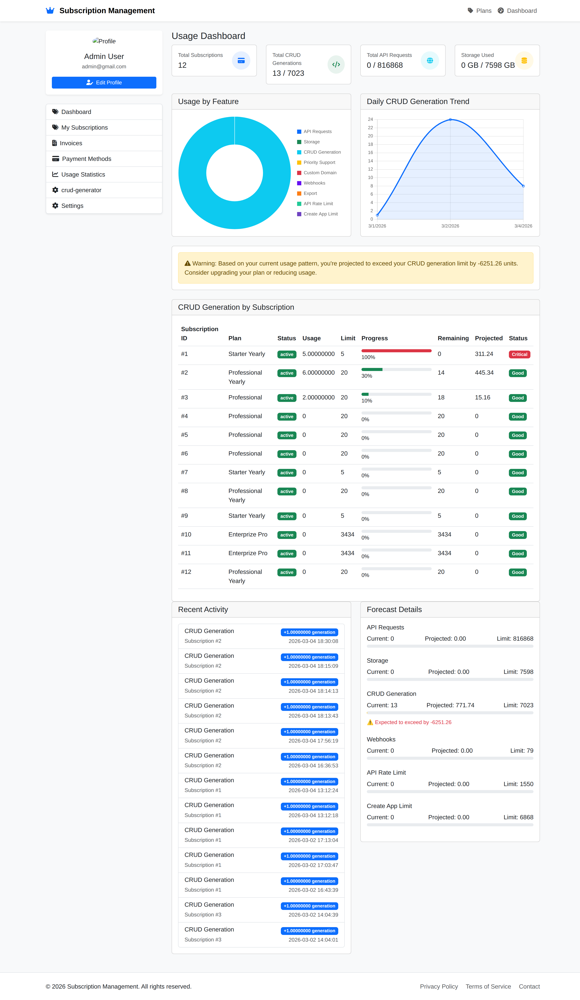
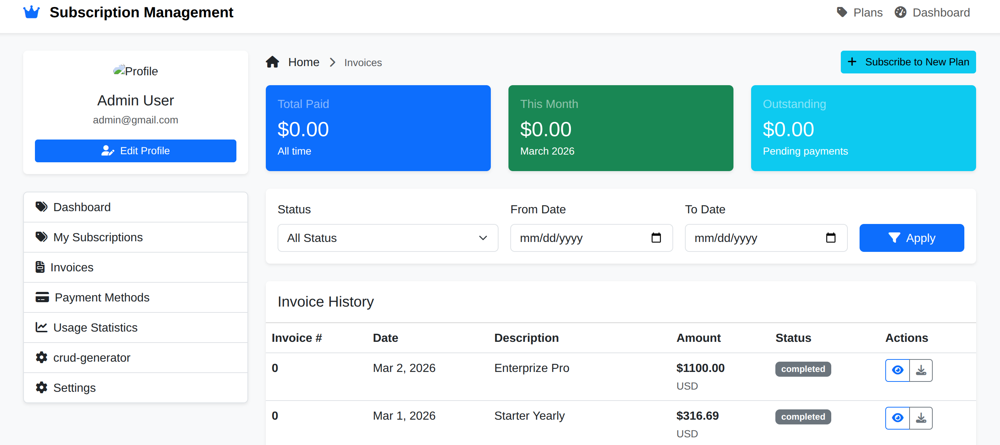
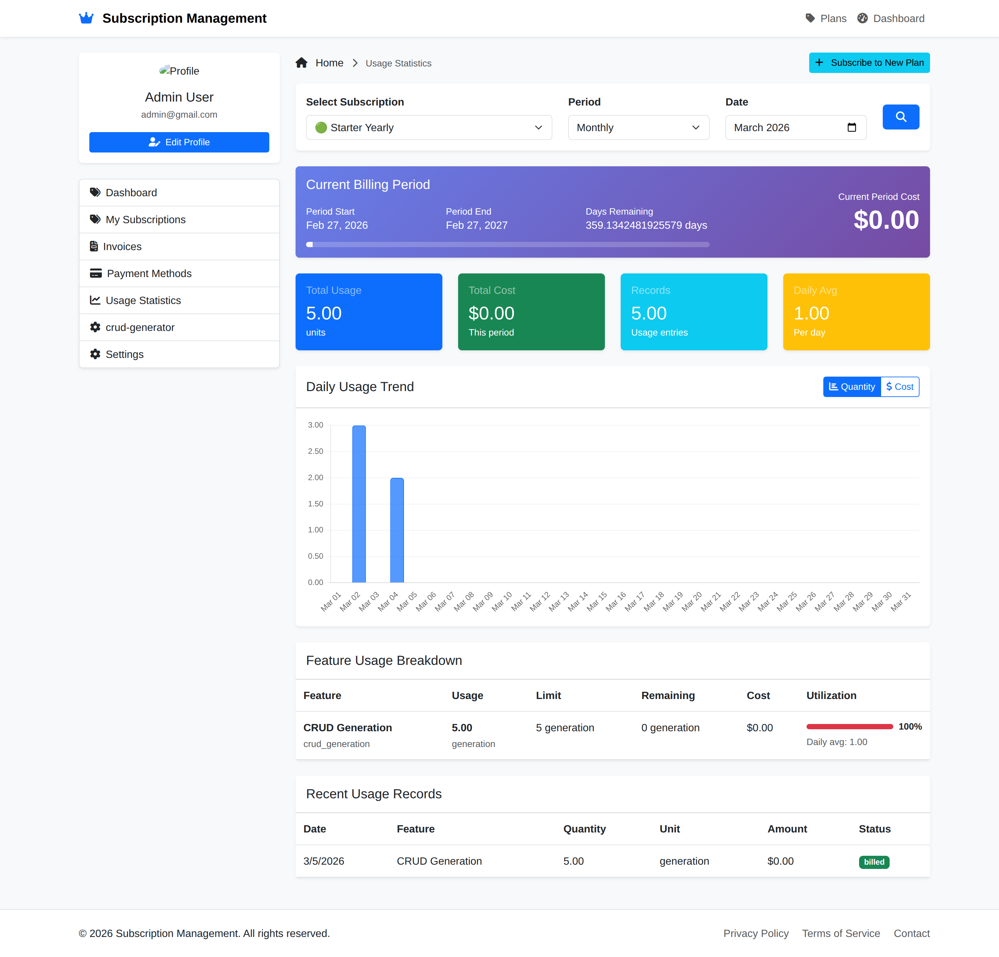

## About Projects

## ডাটাবেস স্ট্রাকচার বিশ্লেষণ

আপনার ডাটাবেসে **পেমেন্ট সংক্রান্ত টেবিলগুলো** এবং তাদের মধ্যে সম্পর্ক:

### 🔍 **প্রধান পেমেন্ট টেবিলসমূহ:**

| **টেবিলের নাম** | **প্রাথমিক কাজ** | **কখন ডাটা প্রবেশ করে** |
|-----------------|------------------|------------------------|
| **payment_masters** | মূল পেমেন্ট রেকর্ড (হেডার) | **প্রতিটি পেমেন্টের শুরুতেই** (order তৈরি的时候) |
| **payment_children** | পেমেন্টের লাইন আইটেম | **payment_masters তৈরি হলে** (একসাথে) |
| **payment_transactions** | গেটওয়ে ট্রানজেকশন | **পেমেন্ট প্রসেস করার সময়** (initiate হলে) |
| **payments** | ইনভয়েসের সাথে সংযুক্ত পেমেন্ট | **ইনভয়েস পেমেন্ট হলে** (সাধারণত webhook থেকে) |
| **payment_allocations** | পেমেন্ট বরাদ্দ | **পেমেন্ট সম্পন্ন হলে** |
| **payment_methods** | সংরক্ষিত পেমেন্ট মেথড | **পেমেন্ট成功后** (save_payment_method = true হলে) |

### 📊 **সম্পূর্ণ পেমেন্ট ফ্লো চার্ট:**

```
সাবস্ক্রিপশন অর্ডার তৈরি
        ↓
payment_masters (pending) ←─── 함께 생성됨
payment_children (pending) ←─── payment_masters এর সাথে
        ↓
পেমেন্ট গেটওয়ে ইনিশিয়ালাইজ
        ↓
payment_transactions (initiated/pending) ←─── নতুন ট্রানজেকশন
        ↓
    ╔══════════════════════════════╩══════════════════════════════╗
    ↓                                                             ↓
পেমেন্ট সফল (callback/webhook)                              পেমেন্ট ব্যর্থ
    ↓                                                             ↓
payment_transactions (completed)                              payment_transactions (failed)
    ↓                                                             ↓
payment_masters (paid) ←─── paid_amount আপডেট                 payment_masters (failed)
    ↓
payment_children (paid) ←─── প্রতিটি লাইন আইটেম আপডেট
    ↓
payment_allocations (payment) ←─── পেমেন্ট বরাদ্দ
    ↓
payments (created) ←─── ইনভয়েসের সাথে সংযুক্ত
    ↓
subscription_orders (completed) ←─── অর্ডার সম্পন্ন
    ↓
subscriptions (active) ←─── নতুন সাবস্ক্রিপশন
    ↓
(যদি save_payment_method = true)
    ↓
payment_methods (saved) ←─── পেমেন্ট মেথড সংরক্ষণ
```

### 💡 **প্রতিটি টেবিলে ডাটা প্রবেশের নির্দিষ্ট সময়:**

#### **1. payment_masters**
```php
// CheckoutController.php - createPaymentMaster() method
// ✅ অর্ডার তৈরি করার সাথে সাথেই
$paymentMaster = PaymentMaster::create([...]); // status = 'pending'
```

#### **2. payment_children**
```php
// payment_masters তৈরি হলে automatically (trigger দ্বারা)
// ✅ payment_masters এর সাথে সাথেই
INSERT INTO payment_children (payment_master_id, ...) VALUES (...);
```

#### **3. payment_transactions**
```php
// processStripePayment(), processSslCommerzPayment() ইত্যাদিতে
// ✅ পেমেন্ট গেটওয়ে কল করার সময়
$transaction = PaymentTransaction::create([...]); // status = 'pending'
```

#### **4. payments**
```php
// WebhookController.php - handleStripeInvoicePaymentSucceeded() ইত্যাদিতে
// ✅ পেমেন্ট成功后, ইনভয়েস তৈরি হলে
$payment = Payment::create([...]); // status = 'completed'
```

#### **5. payment_allocations**
```php
// ✅ পেমেন্ট成功后, payment_children আপডেট হলে (trigger দ্বারা)
INSERT INTO payment_allocations (payment_master_id, ...) VALUES (...);
```

#### **6. payment_methods**
```php
// CheckoutController.php - savePaymentMethod()
// ✅ পেমেন্ট成功后, যদি save_payment_method = true হয়
$paymentMethod = PaymentMethod::create([...]);
```

### 🎯 **আপনার বর্তমান সিস্টেমে ডাটা প্রবেশ:**

```
সাবস্ক্রিপশন অর্ডার → payment_masters (pending) → payment_children (pending)
        ↓
পেমেন্ট গেটওয়ে (SSLCommerz/bKash/Stripe)
        ↓
কলব্যাক রিসিভ (handleCallback)
        ↓
payment_transactions (completed) ←─── (processSslCommerzSuccess এ)
        ↓
payment_masters (paid) ←─── (paid_amount ও status আপডেট)
        ↓
subscriptions (active) ←─── (activateOrderSubscription)
        ↓
(sslcommerz/nagad/bkash) হলে → payment_methods (saved)
```

### 🔑 **মূল পার্থক্য:**

| **টেবিল** | **রোল** | **স্ট্যাটাস চেঞ্জ** |
|-----------|---------|---------------------|
| **payment_masters** | মাস্টার রেকর্ড | pending → paid/failed |
| **payment_children** | লাইন আইটেম | pending → paid |
| **payment_transactions** | গেটওয়ে ট্রানজেকশন | initiated → completed/failed |
| **payments** | ইনভয়েস পেমেন্ট | (শুধু সফল হলে) |
| **payment_allocations** | বরাদ্দ | (শুধু সফল হলে) |
| **payment_methods** | সংরক্ষিত মেথড | (শুধু সেভ করলে) |

### ⚡ **উদাহরণ: SSLCommerz পেমেন্ট ফ্লো**

```php
// 1. অর্ডার তৈরি
$order = $this->createOrder(...);
// 2. payment_masters (pending)
$paymentMaster = $this->createPaymentMaster(...);
// 3. payment_children (pending) ←── automatically

// 4. payment_transactions (pending) ←── processSslCommerzPayment এ
$transaction = PaymentTransaction::create([...]);

// 5. SSLCommerz কলব্যাকে success
// 6. payment_transactions (completed) ←── processSslCommerzSuccess এ
// 7. payment_masters (paid) ←── update
// 8. payment_children (paid) ←── update (trigger দ্বারা)
// 9. payment_allocations (payment) ←── (trigger দ্বারা)
// 10. subscriptions (active) ←── activateOrderSubscription
// 11. payment_methods (saved) ←── saveSslCommerzPaymentMethod
```

### 📝 **সংক্ষিপ্ত উত্তর:**

- ✅ **payment_masters**: অর্ডার তৈরি হওয়ার সাথে সাথেই
- ✅ **payment_children**: payment_masters এর সাথে সাথেই
- ✅ **payment_transactions**: পেমেন্ট প্রসেস করার সময়
- ✅ **payments**: পেমেন্ট成功后 (ইনভয়েস পেমেন্ট)
- ✅ **payment_allocations**: পেমেন্ট成功后
- ✅ **payment_methods**: পেমেন্ট成功后 (যদি save করতে বলা হয়)


## 🏗️ সম্পূর্ণ সাবস্ক্রিপশন ম্যানেজমেন্ট সিস্টেমের ফ্লোচার্ট

আপনার পুরো প্রজেক্টের ডাটা ফ্লো এবং কম্পোনেন্টগুলোর মধ্যে সম্পর্ক নিচে বিস্তারিতভাবে দেখানো হলো:

```
┌─────────────────────────────────────────────────────────────────────────────┐
│                         USER INTERACTION LAYER                               │
│  (Frontend - Blade Templates / API Requests)                                 │
└─────────────────────────────────────────────────────────────────────────────┘
                                    │
                                    ▼
┌─────────────────────────────────────────────────────────────────────────────┐
│                         ROUTING LAYER (api.php)                              │
│  ├─ Public Routes (Plan viewing, Checkout init, OTP)                        │
│  ├─ Protected Routes (Subscriptions, Invoices, Payment Methods)             │
│  └─ Payment Callback Routes (Stripe, SSLCommerz, bKash, etc.)               │
└─────────────────────────────────────────────────────────────────────────────┘
                                    │
                                    ▼
┌─────────────────────────────────────────────────────────────────────────────┐
│                         CONTROLLER LAYER                                     │
├─────────────────────────────────────────────────────────────────────────────┤
│  ┌─────────────────┐  ┌─────────────────┐  ┌─────────────────┐             │
│  │  PlanController │  │   Checkout      │  │  Subscription   │             │
│  │                 │  │   Controller    │  │   Controller    │             │
│  └─────────────────┘  └─────────────────┘  └─────────────────┘             │
│                                                                              │
│  ┌─────────────────┐  ┌─────────────────┐  ┌─────────────────┐             │
│  │   Payment       │  │    Invoice      │  │    Webhook      │             │
│  │   Controller    │  │   Controller    │  │   Controller    │             │
│  └─────────────────┘  └─────────────────┘  └─────────────────┘             │
└─────────────────────────────────────────────────────────────────────────────┘
                                    │
                                    ▼
┌─────────────────────────────────────────────────────────────────────────────┐
│                         SERVICE LAYER                                        │
├─────────────────────────────────────────────────────────────────────────────┤
│  ┌─────────────────┐  ┌─────────────────┐  ┌─────────────────┐             │
│  │  OTPService     │  │  Subscription   │  │   Payment       │             │
│  │                 │  │    Service      │  │    Service      │             │
│  └─────────────────┘  └─────────────────┘  └─────────────────┘             │
│                                                                              │
│  ┌──────────────────────────────────────────────────────────────────────┐  │
│  │              PAYMENT GATEWAY SERVICES                                 │  │
│  ├─────────────┬──────────────┬──────────────┬──────────────┬──────────┤  │
│  │ StripeGateway│ PayPalGateway│ SSLCommerz   │ bKashGateway │ Nagad    │  │
│  │             │              │   Gateway    │              │ Gateway  │  │
│  └─────────────┴──────────────┴──────────────┴──────────────┴──────────┘  │
└─────────────────────────────────────────────────────────────────────────────┘
                                    │
                                    ▼
┌─────────────────────────────────────────────────────────────────────────────┐
│                           DATABASE LAYER                                     │
├─────────────────────────────────────────────────────────────────────────────┤
│                                                                              │
│  ┌──────────────────────────────────────────────────────────────────────┐   │
│  │                        USER MANAGEMENT                                │   │
│  ├──────────────────────────────────────────────────────────────────────┤   │
│  │  users  │  otp_verifications  │  personal_access_tokens  │  sessions │   │
│  └──────────────────────────────────────────────────────────────────────┘   │
│                                    │                                         │
│                                    ▼                                         │
│  ┌──────────────────────────────────────────────────────────────────────┐   │
│  │                      PLAN MANAGEMENT                                 │   │
│  ├──────────────────────────────────────────────────────────────────────┤   │
│  │  plans  │  plan_prices  │  features  │  plan_features  │  discounts │   │
│  └──────────────────────────────────────────────────────────────────────┘   │
│                                    │                                         │
│                                    ▼                                         │
│  ┌──────────────────────────────────────────────────────────────────────┐   │
│  │                   SUBSCRIPTION MANAGEMENT                             │   │
│  ├──────────────────────────────────────────────────────────────────────┤   │
│  │  subscriptions  │  subscription_items  │  subscription_events        │   │
│  │  subscription_orders  │  subscription_order_items                    │   │
│  └──────────────────────────────────────────────────────────────────────┘   │
│                                    │                                         │
│                                    ▼                                         │
│  ┌──────────────────────────────────────────────────────────────────────┐   │
│  │                      PAYMENT MANAGEMENT                               │   │
│  ├──────────────────────────────────────────────────────────────────────┤   │
│  │  payment_masters  │  payment_children  │  payment_transactions       │   │
│  │  payment_allocations  │  payments  │  refunds  │  payment_methods    │   │
│  └──────────────────────────────────────────────────────────────────────┘   │
│                                    │                                         │
│                                    ▼                                         │
│  ┌──────────────────────────────────────────────────────────────────────┐   │
│  │                    BILLING & INVOICING                               │   │
│  ├──────────────────────────────────────────────────────────────────────┤   │
│  │  invoices  │  usage_records  │  metered_usage_aggregates            │   │
│  └──────────────────────────────────────────────────────────────────────┘   │
│                                    │                                         │
│                                    ▼                                         │
│  ┌──────────────────────────────────────────────────────────────────────┐   │
│  │                    RATE LIMITING & ANALYTICS                         │   │
│  ├──────────────────────────────────────────────────────────────────────┤   │
│  │  rate_limits  │  monthly_recurring_revenue  │  subscription_usage_summary│
│  └──────────────────────────────────────────────────────────────────────┘   │
└─────────────────────────────────────────────────────────────────────────────┘
```

## 🔄 **কমপ্লিট ইউজার জার্নি ফ্লো**

```
┌─────────────────────────────────────────────────────────────────────────────────┐
│                        USER REGISTRATION / LOGIN                                 │
└─────────────────────────────────────────────────────────────────────────────────┘
                                      │
                                      ▼
┌─────────────────────────────────────────────────────────────────────────────────┐
│                         BROWSE PLANS (PlanController)                            │
│  └─ View available plans with features and pricing                              │
└─────────────────────────────────────────────────────────────────────────────────┘
                                      │
                                      ▼
┌─────────────────────────────────────────────────────────────────────────────────┐
│                         CHECKOUT PROCESS                                         │
├─────────────────────────────────────────────────────────────────────────────────┤
│  ┌─────────────────────────────────────────────────────────────────────────────┐ │
│  │  Step 1: Initialize Checkout (CheckoutController@initialize)               │ │
│  │    - Validate plan and price                                                │ │
│  │    - Calculate tax and total                                                │ │
│  │    - Return checkout summary                                                │ │
│  └─────────────────────────────────────────────────────────────────────────────┘ │
│                                      │                                           │
│                                      ▼                                           │
│  ┌─────────────────────────────────────────────────────────────────────────────┐ │
│  │  Step 2: For Guest Users (Send OTP)                                         │ │
│  │    └─ OTPService@generateAndSendOtp                                         │ │
│  └─────────────────────────────────────────────────────────────────────────────┘ │
│                                      │                                           │
│                                      ▼                                           │
│  ┌─────────────────────────────────────────────────────────────────────────────┐ │
│  │  Step 3: Verify OTP & Process (verifyOtpAndCheckout)                       │ │
│  │    └─ Create/Get User → Create Order → Create Payment Master               │ │
│  └─────────────────────────────────────────────────────────────────────────────┘ │
│                                      │                                           │
│                                      ▼                                           │
│  ┌─────────────────────────────────────────────────────────────────────────────┐ │
│  │  Step 4: Process Gateway Payment (processGatewayPayment)                    │ │
│  │    ├─ Stripe → processStripePayment                                         │ │
│  │    ├─ SSLCommerz → processSslCommerzPayment                                 │ │
│  │    ├─ bKash → processBkashPayment                                           │ │
│  │    ├─ Nagad → processNagadPayment                                           │ │
│  │    └─ Bank Transfer → processBankTransfer                                   │ │
│  └─────────────────────────────────────────────────────────────────────────────┘ │
└─────────────────────────────────────────────────────────────────────────────────┘
                                      │
                                      ▼
┌─────────────────────────────────────────────────────────────────────────────────┐
│                    PAYMENT GATEWAY REDIRECT                                      │
│  (User redirected to Stripe/SSLCommerz/bKash payment page)                      │
└─────────────────────────────────────────────────────────────────────────────────┘
                                      │
                                      ▼
┌─────────────────────────────────────────────────────────────────────────────────┐
│                    PAYMENT CALLBACK HANDLER                                      │
│  (CheckoutController@handleCallback)                                            │
├─────────────────────────────────────────────────────────────────────────────────┤
│  ┌─────────────────────────────────────────────────────────────────────────────┐ │
│  │  For Each Gateway:                                                          │ │
│  │  ├─ Stripe → handleStripeCallback                                           │ │
│  │  ├─ SSLCommerz → handleSslCommerzCallback → processSslCommerzSuccess       │ │
│  │  ├─ PayPal → handlePayPalCallback                                           │ │
│  │  ├─ bKash → handleBkashCallback                                             │ │
│  │  └─ etc.                                                                    │ │
│  └─────────────────────────────────────────────────────────────────────────────┘ │
└─────────────────────────────────────────────────────────────────────────────────┘
                                      │
                                      ▼
┌─────────────────────────────────────────────────────────────────────────────────┐
│                    POST-PAYMENT PROCESSING                                       │
├─────────────────────────────────────────────────────────────────────────────────┤
│  ┌─────────────────────────────────────────────────────────────────────────────┐ │
│  │  1. Update Transaction (payment_transactions → completed)                   │ │
│  │  2. Update Payment Master (payment_masters → paid)                          │ │
│  │  3. Update Payment Children (payment_children → paid)                       │ │
│  │  4. Create Payment Allocations (payment_allocations)                        │ │
│  │  5. Activate Subscription (activateOrderSubscription)                       │ │
│  │  6. Save Payment Method (savePaymentMethod)                                 │ │
│  │  7. Create Invoice (invoiceService@createInvoice)                           │ │
│  └─────────────────────────────────────────────────────────────────────────────┘ │
└─────────────────────────────────────────────────────────────────────────────────┘
                                      │
                                      ▼
┌─────────────────────────────────────────────────────────────────────────────────┐
│                    SUBSCRIPTION MANAGEMENT                                      │
├─────────────────────────────────────────────────────────────────────────────────┤
│  ┌─────────────────────────────────────────────────────────────────────────────┐ │
│  │  Active Subscription Features:                                              │ │
│  │  ├─ Track usage (UsageController)                                           │ │
│  │  ├─ Generate invoices (InvoiceController)                                   │ │
│  │  ├─ Handle renewals (process_subscription_renewal procedure)                │ │
│  │  ├─ Apply rate limits (rate_limits table)                                   │ │
│  │  └─ Log events (subscription_events)                                        │ │
│  └─────────────────────────────────────────────────────────────────────────────┘ │
└─────────────────────────────────────────────────────────────────────────────────┘
                                      │
                                      ▼
┌─────────────────────────────────────────────────────────────────────────────────┐
│                    SUBSCRIPTION MODIFICATIONS                                   │
├─────────────────────────────────────────────────────────────────────────────────┤
│  ┌──────────────┐  ┌──────────────┐  ┌──────────────┐  ┌──────────────┐        │
│  │   Cancel     │  │   Upgrade    │  │  Downgrade   │  │   Refund     │        │
│  │ Subscription │  │    Plan      │  │    Plan      │  │  Payment     │        │
│  └──────────────┘  └──────────────┘  └──────────────┘  └──────────────┘        │
│         │                │                │                │                    │
│         ▼                ▼                ▼                ▼                    │
│  ┌─────────────────────────────────────────────────────────────────────────────┐ │
│  │  Calculated via: calculate_prorated_amount procedure                        │ │
│  │  Status updated via: update_subscription_status procedure                   │ │
│  │  Refund via: RefundController                                               │ │
│  └─────────────────────────────────────────────────────────────────────────────┘ │
└─────────────────────────────────────────────────────────────────────────────────┘
                                      │
                                      ▼
┌─────────────────────────────────────────────────────────────────────────────────┐
│                    WEBHOOK PROCESSING                                           │
│  (WebhookController)                                                            │
├─────────────────────────────────────────────────────────────────────────────────┤
│  ├─ Stripe Webhooks → handleStripe                                              │
│  ├─ PayPal Webhooks → handlePayPal                                              │
│  ├─ bKash Webhooks → handleBkash                                                │
│  └─ SSLCommerz Webhooks → handleSslCommerz                                      │
│                                                                                  │
│  Webhook Events Processed:                                                       │
│  ├─ invoice.payment_succeeded → handleStripeInvoicePaymentSucceeded             │
│  ├─ customer.subscription.updated → handleStripeSubscriptionUpdated             │
│  ├─ PAYMENT.SALE.COMPLETED → handlePayPalSaleCompleted                          │
│  └─ and more...                                                                  │
└─────────────────────────────────────────────────────────────────────────────────┘
```

## 📊 **ডাটাবেস রিলেশনশিপ ডায়াগ্রাম**

```
┌─────────────┐       ┌─────────────────┐       ┌─────────────────┐
│    users    │───────│  subscriptions  │───────│    invoices     │
└─────────────┘       └─────────────────┘       └─────────────────┘
       │                       │                          │
       │                       │                          │
       ▼                       ▼                          ▼
┌─────────────┐       ┌─────────────────┐       ┌─────────────────┐
│payment_method│       │subscription_items│       │    payments     │
└─────────────┘       └─────────────────┘       └─────────────────┘
       │                       │                          │
       │                       │                          │
       ▼                       ▼                          ▼
┌─────────────┐       ┌─────────────────┐       ┌─────────────────┐
│payment_master│──────│payment_children  │──────│payment_allocations│
└─────────────┘       └─────────────────┘       └─────────────────┘
       │
       │
       ▼
┌─────────────┐       ┌─────────────────┐
│payment_trans │──────│    refunds       │
│  actions     │       └─────────────────┘
└─────────────┘
```

## 🔄 **কীভাবে প্রতিটি টেবিলে ডাটা প্রবেশ করে (টাইমলাইন)**

```
সময়রেখা (Timeline) →
───────────────────────────────────────────────────────────────────────────────

১. অর্ডার প্লেসমেন্ট (Checkout)
   ├── subscription_orders (pending)
   ├── subscription_order_items (pending)
   ├── payment_masters (pending)
   └── payment_children (pending)

২. পেমেন্ট ইনিশিয়েশন
   └── payment_transactions (initiated/pending)

৩. পেমেন্ট সফল (Callback/Webhook)
   ├── payment_transactions (completed)
   ├── payment_masters (paid)
   ├── payment_children (paid)
   ├── payment_allocations (created)
   ├── payments (created - if invoice exists)
   └── payment_methods (saved - if requested)

৪. সাবস্ক্রিপশন অ্যাক্টিভেশন
   ├── subscriptions (active)
   ├── subscription_items (created)
   └── subscription_events (created)

৫. ইনভয়েস জেনারেশন
   └── invoices (created)

৬. রিনিউয়াল প্রসেস (Cron Job)
   ├── invoices (new)
   ├── payment_attempts
   └── subscription_events (renewal)

৭. রিফান্ড (যদি প্রয়োজন)
   ├── refunds (created)
   ├── payment_masters (refunded)
   └── payment_transactions (refunded)

৮. ক্যান্সেলেশন
   ├── subscriptions (canceled)
   └── subscription_events (canceled)
```

## 🎯 **মূল ফিচারসমূহ এবং তাদের ফ্লো**

### **1. ইউজার ম্যানেজমেন্ট**
```
Registration → Email Verification → OTP Login → Profile Update → Password Change
```

### **2. প্ল্যান ম্যানেজমেন্ট**
```
Create Plan → Add Features → Set Pricing → Activate/Deactivate → Display on UI
```

### **3. চেকআউট প্রসেস**
```
Select Plan → Choose Payment Method → Enter Details → Process Payment → Success/Fail
```

### **4. সাবস্ক্রিপশন ম্যানেজমেন্ট**
```
Activate Subscription → Track Usage → Generate Invoices → Auto-renew → Handle Cancellation
```

### **5. পেমেন্ট প্রসেসিং**
```
Initiate Payment → Gateway Redirect → Callback Handle → Update Records → Send Confirmation
```

### **6. ইনভয়েসিং**
```
Generate Invoice → Calculate Tax → Apply Discounts → Mark as Paid → Send PDF
```

### **7. রিফান্ড ম্যানেজমেন্ট**
```
Request Refund → Calculate Prorated → Process Refund → Update Records → Notify User
```

## 📈 **ডাটা ফ্লো ডায়াগ্রাম (সংক্ষিপ্ত)**

```
[User] → [Frontend] → [API Routes] → [Controller] → [Service] → [Gateway] → [Database]
    ↑                                                                           │
    └───────────────────────────────────────────────────────────────────────────┘
                                    (Callback/Webhook)
```

## 🔧 **প্রযুক্তি স্ট্যাক ওভারভিউ**

```
┌─────────────────────────────────────────────────────────────────┐
│                      FRONTEND (Blade/JavaScript)                 │
│  jQuery  │  Axios  │  Stripe.js  │  Toastr  │  Bootstrap        │
└─────────────────────────────────────────────────────────────────┘
                              │
                              ▼
┌─────────────────────────────────────────────────────────────────┐
│                      BACKEND (Laravel 11)                        │
│  Controllers  │  Services  │  Models  │  Middleware  │  Events   │
└─────────────────────────────────────────────────────────────────┘
                              │
                              ▼
┌─────────────────────────────────────────────────────────────────┐
│                    PAYMENT GATEWAYS                              │
│  Stripe  │  PayPal  │  SSLCommerz  │  bKash  │  Nagad  │  Rocket │
└─────────────────────────────────────────────────────────────────┘
                              │
                              ▼
┌─────────────────────────────────────────────────────────────────┐
│                    DATABASE (MySQL)                              │
│  Tables  │  Views  │  Procedures  │  Functions  │  Triggers     │
└─────────────────────────────────────────────────────────────────┘
```

## 🚀 **কীভাবে পুরো সিস্টেম কাজ করে (সংক্ষেপে)**

1. **ইউজার** ওয়েবসাইটে এসে প্ল্যান সিলেক্ট করে
2. **চেকআউট** পেজে গিয়ে পেমেন্ট মেথড সিলেক্ট করে
3. **কন্ট্রোলার** অর্ডার এবং পেমেন্ট মাস্টার তৈরি করে
4. **পেমেন্ট গেটওয়ে** কল করে ইউজারকে রিডাইরেক্ট করে
5. **পেমেন্ট** সম্পন্ন হলে কলব্যাক রিসিভ করে
6. **ট্রানজেকশন** আপডেট করে এবং সাবস্ক্রিপশন অ্যাক্টিভেট করে
7. **ইনভয়েস** জেনারেট করে এবং পেমেন্ট মেথড সংরক্ষণ করে
8. **সাবস্ক্রিপশন** সক্রিয় হয় এবং ইউজার ফিচার ব্যবহার করতে পারে
9. **ক্রন জব** রিনিউয়াল প্রসেস করে এবং মেয়াদ উত্তীর্ণ সাবস্ক্রিপশন হ্যান্ডেল করে
10. **ওয়েবহুক** পেমেন্ট আপডেট এবং অন্যান্য ইভেন্ট হ্যান্ডেল করে

এই পুরো সিস্টেমটি **মডুলার**, **স্কেলেবল** এবং **মেইনটেইনেবল** করে ডিজাইন করা হয়েছে।


## ডাটাবেজের জন্য আপডেটেড সাবস্ক্রিপশন মিডলওয়্যার
 
 
```php
    'subscription' => \App\Http\Middleware\CheckSubscription::class,
```

## মিডলওয়্যার ব্যবহারের উদাহরণ

### **routes/web.php**

```php
<?php

use App\Http\Controllers\CrudGeneratorController;

// Basic subscription check (any active subscription or free plan)
Route::middleware(['auth', 'subscription'])->group(function () {
    Route::get('/crud-generator', [CrudGeneratorController::class, 'create']);
    Route::post('/crud-generator/generate', [CrudGeneratorController::class, 'generate']);
});

// Specific plan check (e.g., 'starter', 'professional', 'enterprise')
Route::middleware(['auth', 'subscription:professional'])->group(function () {
    Route::get('/advanced-features', [AdvancedFeatureController::class, 'index']);
});

// Check specific feature (e.g., 'crud_generation' feature)
Route::middleware(['auth', 'subscription:any,crud_generation'])->group(function () {
    Route::get('/generate-crud', [CrudGeneratorController::class, 'create']);
});

// API routes with subscription check
Route::middleware(['auth:sanctum', 'subscription'])->prefix('v1')->group(function () {
    Route::post('/crud/generate', [CrudGeneratorController::class, 'generate']);
});
```

## কন্ট্রোলারে ব্যবহারের উদাহরণ

```php
<?php

namespace App\Http\Controllers;

use Illuminate\Http\Request;
use Illuminate\Support\Facades\Auth;
use App\Models\Subscription;

class CrudGeneratorController extends Controller
{
    public function create()
    {
        $user = Auth::user();
        $subscription = Subscription::where('user_id', $user->id)
            ->whereIn('status', ['active', 'trialing'])
            ->with('plan')
            ->first();
        
        return view('crud-generator.create', compact('subscription'));
    }

    public function generate(Request $request)
    {
        // The middleware already verified subscription
        $user = Auth::user();
        
        // Get subscription for usage tracking
        $subscription = Subscription::where('user_id', $user->id)
            ->whereIn('status', ['active', 'trialing'])
            ->first();
        
        // Check monthly limit from plan_features
        $feature = \DB::table('plan_features')
            ->join('features', 'plan_features.feature_id', '=', 'features.id')
            ->where('plan_features.plan_id', $subscription->plan_id)
            ->where('features.code', 'crud_generation')
            ->first();
        
        if ($feature && is_numeric($feature->value)) {
            // Check current month usage
            $currentUsage = \DB::table('usage_records')
                ->where('subscription_id', $subscription->id)
                ->where('feature_id', $feature->feature_id)
                ->whereMonth('billing_date', now()->month)
                ->sum('quantity');
            
            if ($currentUsage >= $feature->value) {
                return response()->json([
                    'success' => false,
                    'message' => "You have reached your monthly limit of {$feature->value} CRUD generations."
                ], 403);
            }
        }
        
        // Process CRUD generation...
        
        // Record usage
        \DB::table('usage_records')->insert([
            'subscription_id' => $subscription->id,
            'feature_id' => $feature->feature_id,
            'quantity' => 1,
            'unit' => 'generation',
            'billing_date' => now()->toDateString(),
            'recorded_at' => now(),
            'created_at' => now(),
            'updated_at' => now(),
        ]);
        
        return response()->json([
            'success' => true,
            'message' => 'Operation successfully'
        ]);
    }
}
```

## ব্লেড টেমপ্লেটে ব্যবহার

```blade
@auth
    @php
        $subscription = App\Models\Subscription::where('user_id', Auth::id())
            ->whereIn('status', ['active', 'trialing'])
            ->with('plan')
            ->first();
    @endphp
    
    @if($subscription)
        <div class="alert alert-info">
            <strong>Current Plan:</strong> {{ $subscription->plan->name }}<br>
            <strong>Status:</strong> {{ ucfirst($subscription->status) }}<br>
            @if($subscription->current_period_ends_at)
                <strong>Expires:</strong> {{ $subscription->current_period_ends_at->format('M d, Y') }}
                ({{ now()->diffInDays($subscription->current_period_ends_at) }} days left)
            @endif
        </div>
    @else
        <div class="alert alert-warning">
            You don't have an active subscription. 
            <a href="{{ route('website.plans.index') }}">Subscribe now</a>
        </div>
    @endif
@endauth
```

## মিডলওয়্যারের মূল ফিচারসমূহ

1. **সক্রিয় সাবস্ক্রিপশন চেক** - `status` = 'active' বা 'trialing'
2. **মেয়াদ বৈধতা চেক** - `current_period_ends_at` > now()
3. **ফ্রি প্ল্যান সাপোর্ট** - amount = 0 বা 'free' নামের প্ল্যান
4. **প্ল্যান-নির্দিষ্ট চেক** - নির্দিষ্ট প্ল্যানের জন্য অ্যাক্সেস কন্ট্রোল
5. **ফিচার-নির্দিষ্ট চেক** - plan_features টেবিলের মাধ্যমে ফিচার চেক
6. **ইউসেজ ট্র্যাকিং** - usage_records টেবিলের মাধ্যমে ব্যবহার ট্র্যাকিং
7. **API সাপোর্ট** - JSON রেসপন্স সহ API রিকোয়েস্ট সাপোর্ট

এই মিডলওয়্যার সম্পূর্ণ ডাটাবেজ স্ট্রাকচারের সাথে সামঞ্জস্যপূর্ণ এবং CRUD জেনারেটর বা অন্যান্য ফিচার প্রোটেক্ট করতে ব্যবহার করতে পারবেন।


### UI:

## Subscriptions Plan:



## Plan Details:


## checkout plan






## Dashboard


## My subscriptions


## Invoice


## order invoice

## Usages 



